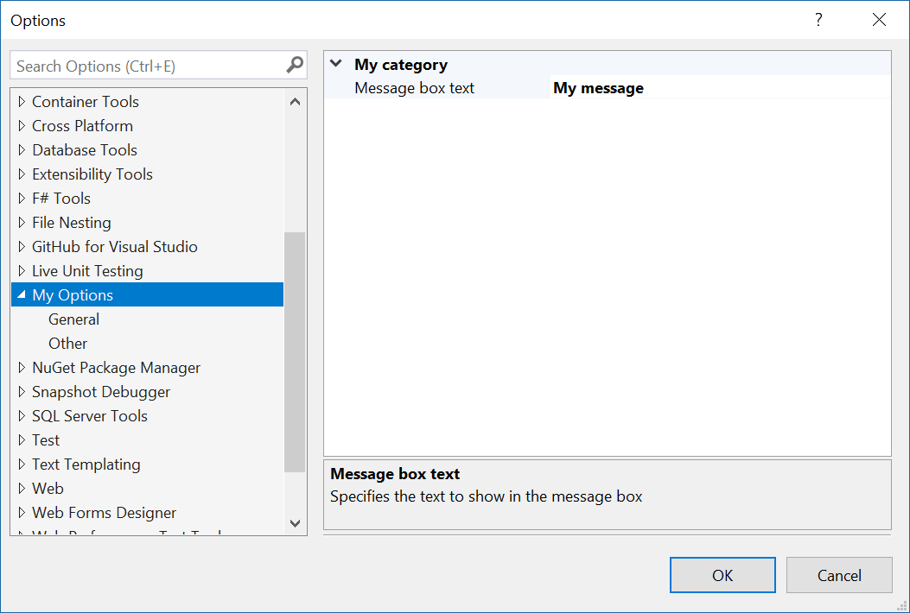

# Options example

**Applies to Visual Studio 2015 and newer**

This sample shows how to correctly specify and consume options for a Visual Studio extension that is both thread-safe and performant.

Documentation coming soon...